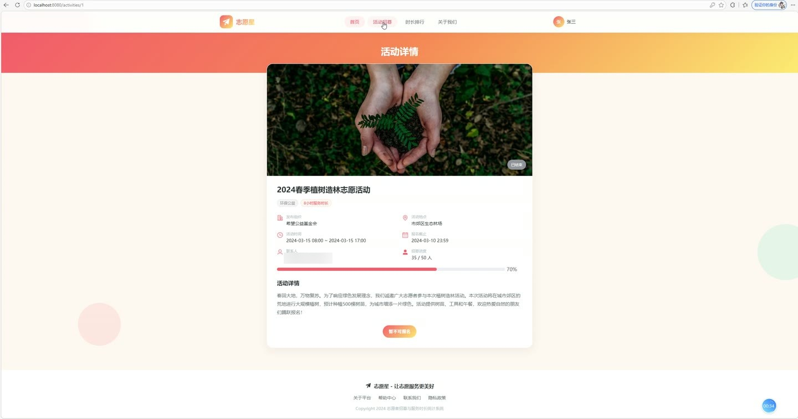
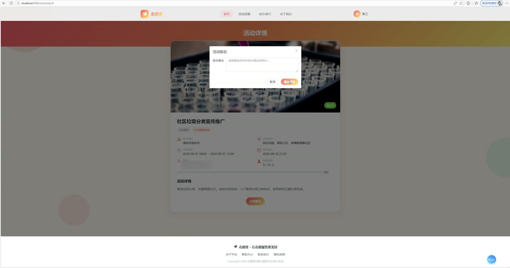

# (附文档)Springboot3+Vue3+MySQL 志愿者招募与服务时长统计系统

**技术栈**：Springboot3、Vue3、MySQL

### 系统简介

本系统是一套基于 Spring Boot 3 + Vue 3 + MySQL 构建的志愿者招募与服务时长统计平台，采用前后端分离架构。系统支持普通志愿者用户与管理员两种角色，覆盖活动浏览报名、服务时长记录、星级评定、数据统计等完整业务流程。
 
### 核心功能
 
### 普通用户端

 
- 用户注册/登录：通过用户名密码注册新账号，登录后获取 JWT Token，支持自动填充角色为志愿者。 
- 浏览活动列表：按活动标题、分类、状态（草稿/报名中/进行中/已结束）筛选分页查看活动。 
- 查看活动详情：展示活动封面、描述、地点、起止时间、招募人数/已报名人数、服务时长、联系人信息。 
- 报名活动：点击报名按钮提交报名（可填写备注），系统校验活动状态为报名中、人数未满且未重复报名。 
- 取消报名：在我的活动列表中取消报名，系统自动释放活动名额并更新已报名人数。 
- 查看我的报名记录：分页查看自己所有报名记录，按状态筛选（待审核/已通过/已拒绝/已取消）。 
- 查看我的服务时长：分页查看个人服务时长记录，包含活动名称、时长、服务日期、审核状态。 
- 查看志愿者排行榜：查看全体志愿者按总服务时长排名的榜单（支持限制返回条数）。 
- 提交反馈意见：针对活动提交反馈（类型、内容），系统记录提交人及活动关联。 
- 查看我的反馈：分页查看自己提交的反馈及管理员回复内容。 
- 编辑个人资料：修改真实姓名、手机、邮箱、头像、性别、生日、身份证号、技能标签、密码。 
- 查看个人信息：获取当前登录用户的完整资料（密码脱敏）。
 
### 管理员端

 
- 仪表盘概览：查看志愿者总数、活动总数、报名总数、总服务时长（已审核）四项核心数据。 
- 志愿者管理：分页搜索志愿者（按姓名/用户名/手机），支持启用/禁用账号、设置星级等级（0-5星）。 
- 活动管理：分页搜索活动（标题/分类/状态），支持发布新活动、编辑活动、修改活动状态（报名中/进行中/已结束/已取消）、删除活动。 
- 发布/编辑活动：填写标题、分类、封面（支持本地上传）、描述、地点、活动起止时间、报名起止时间、招募人数、服务时长、联系人、状态（草稿/发布）。 
- 报名管理：查看所有报名记录（按活动/状态筛选），审核报名（通过/拒绝）并填写审核备注，记录审核时间。 
- 服务时长管理：查看所有时长记录（按用户/活动/状态筛选），录入单条时长（用户、活动、时长数值、服务日期、描述），批量录入多条时长，审核/驳回时长记录。 
- 反馈管理：查看所有用户反馈（按状态筛选），回复反馈内容并记录回复时间。 
- 轮播图管理：新增/编辑/删除轮播图，支持设置标题、图片链接、跳转链接、排序号、启用状态。 
- 月度服务时长统计：查看近12个月每月总服务时长的趋势数据。 
- 分类统计：按活动分类统计参与志愿者人数和总服务时长。 
- 志愿者排名：查看全体志愿者按总服务时长排名的完整榜单（可配置返回条数）。
 
### 技术栈

 后端框架Spring Boot 3 ORMMyBatis-Plus 权限认证Spring Security + JWT 前端框架Vue 3 + Element Plus 状态管理Pinia 构建工具Vite 数据库MySQL 文件上传MultipartFile 本地存储
 
### 交付内容

 
- 后端完整源码 
- 前端完整源码 
- 数据库初始化脚本 
- 万字文档

## 界面展示

---

## 获取完整源码 + 万字文档

本仓库为项目介绍页。**完整前后端源码、数据库初始化脚本、万字项目文档**，请加微信 `kangkangcode`，或访问 [codekk.top](http://codekk.top) 获取。

可作课程设计 / 毕业设计参考，支持远程部署调试。